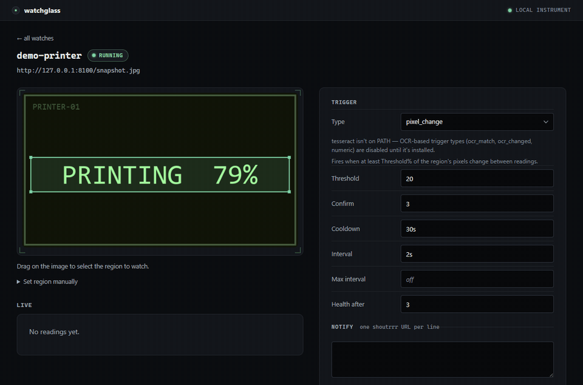

# watchglass

**changedetection.io for video streams.** Point it at any screen — a 3D
printer's LCD, a lab instrument, a server console — draw a region, and get a
push notification when that region's text or pixels change. Self-hosted, one
binary, nothing leaves your network.



*Recorded against the bundled [demo rig](examples/demo/) — run it yourself
with two commands, no camera needed.*

> Early development. Core engine, web UI, RTSP/ffmpeg sources,
> MQTT/Home Assistant discovery, Docker packaging, and tagged binary
> releases all work; the Home Assistant add-on installs as a custom
> repository but is still experimental.

## Install

### Docker Compose (recommended)

    git clone https://github.com/darrenhuai/watchglass && cd watchglass
    mkdir -p config
    docker compose up -d

Binds to `127.0.0.1:8080` by default — widen the port mapping in
`docker-compose.yml` deliberately if you want it reachable elsewhere on your
network (see [Authentication](#authentication) first). Config and the
SQLite history database live in `./config`, bind-mounted into the
container.

### Docker (build it yourself)

    git clone https://github.com/darrenhuai/watchglass && cd watchglass
    docker build -t watchglass .
    docker run -d --name watchglass -p 127.0.0.1:8080:8080 -v ./config:/config watchglass

### Binaries

Grab the latest [release](https://github.com/darrenhuai/watchglass/releases)
for prebuilt binaries — Linux, Windows, and macOS — no Go toolchain
required. ffmpeg and tesseract aren't bundled; install them separately if
you need RTSP sources or OCR triggers.

**Windows, running the native binary (not Docker):** stop it with **Ctrl+C
in the console that's running it**, not Task Manager or `taskkill`. Windows
has no forceless `taskkill` for a console app — anything else kills the
process outright, so the graceful-shutdown path (draining the web server,
publishing the MQTT last-will, closing the history database cleanly) never
runs. A service wrapper that sends a real stop signal works too. This
doesn't affect the Docker image: its exec-form `ENTRYPOINT`/`CMD` lets a
real `docker stop` deliver SIGTERM straight to the process.

### From source (Go toolchain)

    git clone https://github.com/darrenhuai/watchglass && cd watchglass
    go install ./cmd/watchglass

Installs to `$(go env GOPATH)/bin` (`$HOME/go/bin` by default).

## Quick start

1. Install [tesseract](https://github.com/tesseract-ocr/tesseract) (only
   needed for OCR triggers reading text; seven-segment digit displays use
   the built-in decoder instead — see [OCR engines](#ocr-engines)):
   `apt install tesseract-ocr` or `choco install tesseract`.
2. Start with an empty config and run watchglass:

       echo "watches: []" > config.yaml
       go run ./cmd/watchglass -config config.yaml

   In `cmd.exe`, drop the quotes — `echo watches: [] > config.yaml` — since
   cmd writes them into the file as-is and the result isn't valid YAML
   (bash and PowerShell strip them).

   `-config` defaults to `config.yaml` in the working directory, so if you
   used that name you can omit the flag. Readings are logged to a SQLite
   database at `-db` (default `watchglass.db`), which is created
   automatically on first run.

   No camera handy? Run the bundled demo rig instead — no config needed, no
   camera required — see [examples/demo/README.md](examples/demo/).
3. Open http://127.0.0.1:8080 in your browser, click **Add a watch**, point
   `source` at your camera's snapshot URL, then open the new watch: drag a
   rectangle over the part of the screen you care about, hit **Test this
   region** to see exactly what the OCR engine reads, tune the preprocessing
   sliders (grayscale, invert, binarize, upscale) until the text comes back
   clean, pick a trigger type, and **Save**. This is the same drag → test →
   save loop the hero GIF above records — it's the low-friction path, not
   hand-editing YAML. `examples/config.yaml` is still there as copy-paste
   material for more watches once you've got the hang of it, and a UI Save
   merges into a hand-edited file rather than rewriting it (see
   [Web UI](#web-ui)).

## Sources

| Source string | What it reads | Needs |
|---|---|---|
| `http://…` / `https://…` | a snapshot/MJPEG URL (most IP cameras expose one) | nothing |
| `rtsp://…` / `rtsps://…` | an RTSP stream, over TCP | ffmpeg on PATH |
| `v4l2:/dev/video0` | a Linux webcam or capture card | ffmpeg on PATH |
| `dshow:video=Camera Name` | a Windows webcam or capture card | ffmpeg on PATH |
| `ffmpeg:<args>` | anything else — the args go to ffmpeg verbatim | ffmpeg on PATH |

For RTSP and device sources watchglass spawns ffmpeg once per poll, grabs a
single frame, and lets it exit. There is no persistent decoder, so a watch
costs nothing between checks — the whole daemon sits around 55MB of RAM
with a watch polling a 640x360 snapshot every 2 seconds, no GPU needed.
ffmpeg is never bundled — install your distribution's package.

If a camera speaks something exotic (HomeKit, Nest, WebRTC-only), run
[go2rtc](https://github.com/AlexxIT/go2rtc) alongside and point watchglass at
its snapshot endpoint: `http://go2rtc-host:1984/api/frame.jpeg?src=cam1`.

### When a stream dies

After `health_after` consecutive polls with no reading (default 3) — the
grab failing, or a frame arriving that OCR can't read — a watch sends one
"down" notification quoting the error, and one more when it recovers. It
never repeats while a camera stays down, and it keeps polling throughout —
a watcher that silently stopped watching is worse than no watcher. The
verdict survives a Save & restart: a watch that was down stays shown as
down until a poll actually produces a reading again, and recovers exactly
once when it does.

### Adaptive polling

Set `max_interval` above `interval` and a watch doubles its poll gap while
nothing changes, snapping back to `interval` the moment something does. It is
off unless you set it. Note that backing off also stretches how long
`confirm` takes in wall-clock time. A failed poll immediately returns the
watch to its base interval, so stream-death detection (`health_after`) is
never delayed by backoff.

## Home Assistant

Add an `mqtt:` block and every watch shows up in Home Assistant
automatically — no YAML on the HA side:

    mqtt:
      broker: tcp://homeassistant.local:1883
      username: watchglass
      password: secret

Each watch becomes a device with four entities via MQTT discovery: a
**reading** sensor (the latest OCR text or pixel-change percentage), a
**health** sensor (stream up/down), a **motion** sensor that pulses when the
trigger fires, and a **camera** showing the crop from the last fire. State
survives HA restarts (retained topics), and watchglass announces its own
availability with a last-will message, so entities go unavailable if it
stops.

Broker down? watchglass keeps watching and reconnects in the background —
MQTT is never allowed to take the watcher down with it.

The broker password lives in plaintext in `config.yaml` — keep the file
private (watchglass writes it `0o600` on Unix); a secrets-manager story is
future work.

### Add-on (experimental)

This repository doubles as a Home Assistant add-on repository. Add
`https://github.com/darrenhuai/watchglass` under Settings → Add-ons →
Add-on store → Repositories (or use [this link](https://my.home-assistant.io/redirect/supervisor_add_addon_repository/?repository_url=https%3A%2F%2Fgithub.com%2Fdarrenhuai%2Fwatchglass)) and install
**watchglass**. It pulls the published image and serves the dashboard on
port 8080. It hasn't been through the official store, so expect rough
edges — details and caveats in [`addon/DOCS.md`](addon/DOCS.md).

### Snapshot in your push notifications

Notifications to [ntfy](https://ntfy.sh) topics include the cropped image of
the region that fired — the actual pixels, in the push. Use `ntfy://host/topic`
(TLS) or `ntfy+http://host:port/topic` (local server). Other services get
the text.

### Other notification services

Every `notify` URL is handed to [shoutrrr](https://shoutrrr.nickfedor.com/latest/services/overview/)
(the maintained nicholas-fedor fork) under the hood — see its docs for the
full list of supported services and URL formats (Discord, Slack, Telegram,
Pushover, and more), not just ntfy. A plain webhook is
`generic+http://host:port/path?template=json`.

A fire arrives titled `watchglass: printer` with the body
`printer: pattern matched — PRINT COMPLETE`: the watch's name is in the body
too, because a plain webhook only gets the body. **Send test notification**
under the Notify box sends a test to the URLs as typed, before you save.
Saving refuses a URL that can't work (`https://ntfy.sh/topic`, a pasted
Discord webhook link) and offers the right form. The Live panel and the watch
list show when an alert couldn't be delivered.

## Web UI

watchglass serves a local dashboard while it runs — open http://127.0.0.1:8080.
Add a watch, open it, drag a rectangle over the part of the screen you care
about, and hit **Test this region** to see exactly what the OCR engine reads —
tune the preprocessing sliders (grayscale, invert, binarize, upscale) until
the text comes back clean, then **Save**. For a seven-segment digit display
pick `sevenseg` in the **Engine** select instead and skip the sliders; the
test panel then shows one chip per digit with its confidence (see
[OCR engines](#ocr-engines)). The page shows a live strip of recent readings
so you can verify triggers before trusting them.

> **Save keeps your file.** Clicking **Save** merges the change into
> `config.yaml` rather than rewriting it: hand-written comments, key order,
> quoting, anchors, line endings and `- ` placement survive, and a save
> that changes nothing doesn't touch the file. What the first real change
> does lose: blank lines may be collapsed, end-of-line comments lose their
> column alignment, a comment at the end of a block may shift indentation,
> nested blocks in a 4-space file are re-indented, and a URL inside a
> flow-style list (`[...]`) comes back quoted. Deleting a watch deletes its
> own comments with it; a comment block parked above it moves to the next
> watch. A file that no longer parses (a hand edit left half done) is never
> overwritten — Save reports the error and leaves it alone.

The UI binds to localhost only by default. `-listen 0.0.0.0:8080` exposes it
on your network — add an `auth:` block first (below) or put it behind a
reverse proxy. Watch `source` URLs are also fetched by the server, so
exposing the UI beyond localhost hands whoever reaches it a server-side fetch
primitive too — another reason not to expose it unauthenticated.

### Authentication

Add an `auth:` block to `config.yaml` to put the web UI behind HTTP Basic
auth:

    auth:
      username: admin
      password: change-me

The password lives in plaintext in `config.yaml` — same posture as the MQTT
broker password above (the file is written `0o600` on Unix; keep it
private). Omit the block entirely for no auth, which is fine as long as you
stay on localhost.

If `-listen` is bound to anything other than `127.0.0.1`/`localhost` and no
`auth:` block is set, watchglass logs a `WARNING` on every startup. The
Docker image always binds `0.0.0.0:8080` *inside* the container — that's
correct there, since reachability is actually decided by the container's
port mapping, not the bind address — so the container logs that warning on
every start regardless. With the compose file's default mapping
(`127.0.0.1:8080:8080`) the UI stays loopback-only anyway, making the
warning expected and harmless; add an `auth:` block before widening that
mapping to anything else.

### Behind a reverse proxy

`-base-path` mounts the UI under a URL prefix — e.g. `https://home.example.com/watchglass/`
instead of its own subdomain or port — for a proxy that **strips the
prefix** before forwarding. watchglass itself always serves at `/`; it never
routes on the prefix. All `-base-path` does is prepend it to every link,
form action, and redirect the UI writes into its own HTML, so the browser's
next request already carries the prefix the proxy is about to strip back
off. An nginx `location` block doing that strip looks like:

    location /watchglass/ {
        proxy_pass http://127.0.0.1:8080/;
    }

Note the trailing slash on both sides — that's what tells nginx to strip
`/watchglass/` before forwarding. Pair it with:

    go run ./cmd/watchglass -base-path /watchglass

`-base-path` must start with `/`; a trailing slash is trimmed automatically,
so `/watchglass` and `/watchglass/` are equivalent. Leaving it unset (the
default) is unchanged, unprefixed behavior — nothing here matters unless
you're proxying under a subpath.

Because watchglass never generates an absolute self-URL (everything it
writes is prefix-relative, per above), it has no need to read
`X-Forwarded-Host`, `X-Forwarded-Proto`, or similar headers, and none of
that needs to be configured on the proxy side. The [Authentication](#authentication)
section above still applies in front of a proxy exactly as it does standalone —
`-base-path` only changes URLs, not access control.

## History

Every reading is recorded to a SQLite database at `-db` (default
`watchglass.db`). `history_days` in `config.yaml` controls how long they're
kept — default 30, or `-1` to keep everything forever:

    history_days: 30

Pruning runs once at startup and then once every 24 hours; with `-1` it
never runs at all.

Rough sizing: measured at ~189 bytes/row (including its two indexes) at a 2s
poll interval, that's roughly 8 MB/day per watch — about 245 MB at the
default 30-day retention. Scales linearly with `interval` (halve the poll
rate, halve the size) and with how many watches you run; worth knowing
before sizing onto an SD card (e.g. the Home Assistant add-on target).

## Trigger types

| type | fires when |
|---|---|
| `ocr_match` | region text matches a regex (edge-triggered) |
| `ocr_changed` | region text changes to a new stable value |
| `numeric` | a number extracted from region text crosses a threshold |
| `pixel_change` | at least `threshold`% of region pixels change |

All OCR triggers require `confirm` consecutive identical readings before a
state is believed (filmed screens flicker), and every trigger respects
`cooldown`.

The `numeric` trigger requires `op: gt` or `op: lt` to say which direction
crosses `threshold`. By default it parses the first number found in the OCR
text; set `pattern` to a regex to extract a specific value instead — if the
regex has a capture group, that group's text is parsed rather than the whole
match.

### OCR engines

The three OCR triggers read the region with one of three engines, chosen
per watch with `engine:`:

| engine | reads | needs |
|---|---|---|
| `tesseract` (default) | printed text — LCD menus, console output, status lines | the `tesseract` binary on PATH |
| `sevenseg` | seven-segment digits — bench scales, multimeters, thermometers, clocks | nothing; built in |
| `rapidocr` | printed text the tesseract path struggles with — low-contrast LCDs, small or stylised fonts, odd angles (PaddleOCR PP-OCR mobile models via RapidOCR) | `python3`/`python` on PATH with `pip install rapidocr onnxruntime` |

`sevenseg` is a geometry decoder, not a font model: it binarizes the crop,
works out the polarity itself (lit LED on dark and dark LCD on light both
read with no `preprocess` settings), finds each digit's bars and checks the
seven segment positions of every cell. It returns the digits joined —
`23.5`, `-8.0`, `1234` — a `-` sign and decimal point included, and marks a
glyph whose bars spell no digit as `?`. **Test this region** shows one chip
per glyph with its confidence, so you can see which digit is marginal
before trusting a threshold. Crop tightly around the digits (leave units
and labels out), and keep the camera close to head-on; the decoder expects
upright digits and does not correct a slanted view.

```yaml
  - name: bench-scale
    source: http://192.168.1.80/snapshot.jpg
    region: {x: 0.40, y: 0.35, w: 0.22, h: 0.10}
    engine: sevenseg
    trigger:
      type: numeric
      pattern: "([0-9.]+)"
      op: gt
      threshold: 500
```

A watch without `engine:` keeps using tesseract, so nothing changes for
existing configs; a sevenseg watch starts fine on a box that has no
tesseract at all.

`rapidocr` runs the PaddleOCR PP-OCR models in their small CPU form,
driven through the [RapidOCR](https://github.com/RapidAI/RapidOCR)
Python package. watchglass never links it: each read spawns a Python
interpreter, feeds it the crop and reads JSON back, so the binary stays
static and the engine is optional. At boot watchglass looks for `python3`,
then `python`, and keeps the first that can `import rapidocr, onnxruntime`
(`-python /path/to/python` picks one explicitly, e.g. a venv); the log says
which it found or why it didn't. Note that `pip install rapidocr` alone is
not enough — the `onnxruntime` package is the inference runtime. Every read
starts an interpreter and loads the models, which costs about 2–4 s on a
desktop CPU and more on a Pi, so give a rapidocr watch an `interval` of
10 s or longer. The Docker image and the Home Assistant add-on don't ship
Python or the models; for now `rapidocr` is for bare-metal and venv
installs.

```yaml
  - name: printer-lcd
    source: http://192.168.1.55/snapshot.jpg
    interval: 15s
    region: {x: 0.20, y: 0.35, w: 0.60, h: 0.15}
    engine: rapidocr
    trigger:
      type: ocr_match
      pattern: "(?i)print complete"
```

## Recipes

Seeded, copy-paste `watches:` configs for common gear live in
[docs/recipes](docs/recipes/): a generic snapshot camera, RTSP, a
closed-firmware printer LCD, a server console/IPMI KVM, and a seven-segment
lab instrument. Don't see your screen there — [open an
issue](https://github.com/darrenhuai/watchglass/issues) and we'll add one.

## Roadmap

Post-v1, roughly in priority order:

- [ ] Home Assistant Add-on — installs as a custom repository today (see
      `addon/DOCS.md`); official store submission remains. The image itself
      is published for amd64, arm64 and arm/v7.
- [x] RapidOCR engine (`engine: rapidocr`, PaddleOCR PP-OCR mobile models
      via the RapidOCR package)
- [x] Native seven-segment decoder (`engine: sevenseg`, see
      [OCR engines](#ocr-engines))
- [x] Recipes gallery (community configs per device)
- [ ] Template matching triggers ("this icon appeared")
- [ ] Multi-region compound conditions ("A matches AND B > 200")
- [ ] Optional VLM engine (opt-in, off by default, clearly labeled)

## License

MIT

MQTT support uses the Eclipse Paho Go client (EPL-2.0/EDL-1.0).
