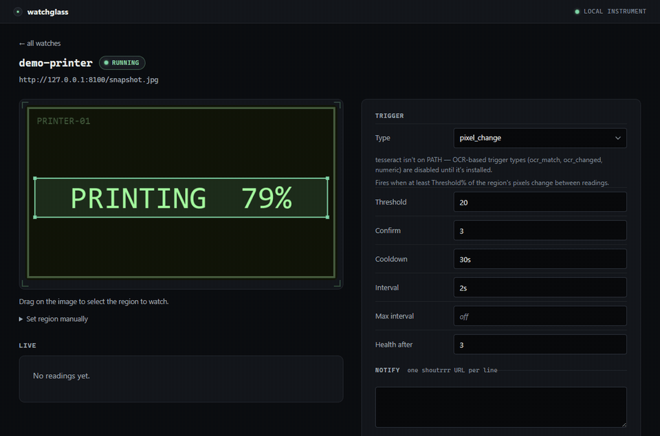
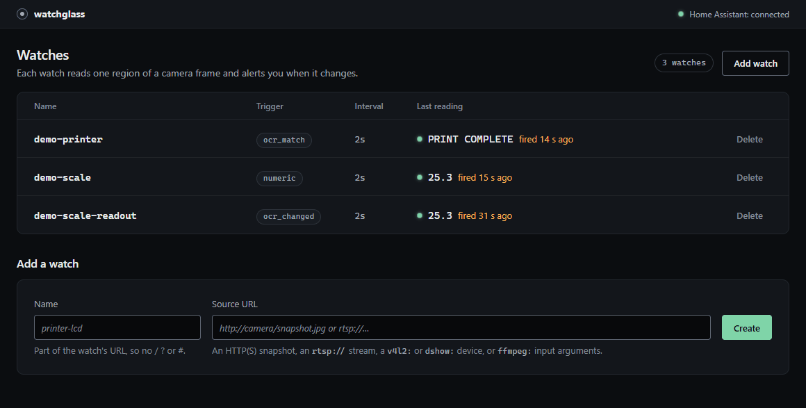
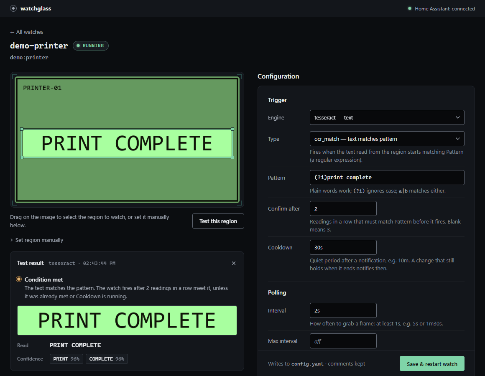
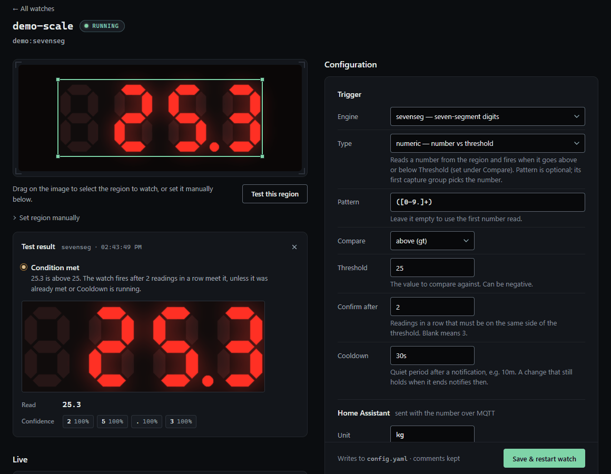

# watchglass

**Get a notification when a screen changes, even one with no API.**

You have a device with a screen and no way to ask it anything: a 3D printer, a heat pump panel, a boiler, a bench scale, a server console, a washer with a countdown. Point a camera you already own at it, drag a box around the part you care about, and watchglass reads the text or digits in that box every few seconds and pings your phone when they change or match a pattern. PRINT COMPLETE shows up on the printer and your phone buzzes; the boiler shows an error code and you get the photo on Telegram; a number becomes a Home Assistant sensor with a graph.

Think changedetection.io, but for physical screens: self-hosted, one binary, nothing leaves your network.

[](https://github.com/darrenhuai/watchglass/releases/latest)
[](https://github.com/darrenhuai/watchglass/pkgs/container/watchglass)

[](LICENSE)

## Try it in 30 seconds (no camera needed)

```bash
docker run --rm -p 127.0.0.1:8080:8080 -e WATCHGLASS_DEMO=1 ghcr.io/darrenhuai/watchglass
```

Open http://127.0.0.1:8080. Two demo watches fire about 20 seconds in; this clip is that run:



- **Draw, test, save.** Drag a box over the live frame and see what it reads before you save. No YAML.
- **Reads the screen.** Text (tesseract), seven-segment digits (built-in decoder, no ssocr) or pixel change.
- **Doesn't flap.** A reading has to hold for a few polls before it counts, and a cooldown stops repeat pings.
- **Notifies anywhere.** ntfy (with the crop attached), Discord, Telegram, Slack, Pushover, email and webhooks.
- **Home Assistant over MQTT.** Each watch shows up as a device; a number becomes a sensor HA can graph.
- **Tells you when the camera dies.** One "down" alert, one "back up" alert, no spam.
- **Runs on what you have.** Snapshot URLs, MJPEG and RTSP, webcams, your own screen. 55 MB RAM, no GPU.

No Docker? Unpack the [archive for your system](https://github.com/darrenhuai/watchglass/releases/latest) and run `watchglass -demo`. For the ping on your phone, subscribe to a topic of your own in the [ntfy app](https://ntfy.sh), paste `ntfy://ntfy.sh/<your-topic>` into a watch's Notify box and press **Send test notification**.

Tried Home Assistant's seven_segments/ssocr and gave up? Here you drag a box and see what it reads before you save. [Moving over from ssocr](docs/recipes/from-seven-segments.md) maps your old settings.

## Install

> watchglass is v0.x: the config format may still change between minor versions.

**Docker Compose.** The image includes ffmpeg and tesseract and runs on amd64, arm64 and armv7.

```bash
mkdir -p watchglass/config && cd watchglass
curl -fsSLO https://raw.githubusercontent.com/darrenhuai/watchglass/master/docker-compose.yml
PUID=$(id -u) PGID=$(id -g) docker compose up -d
```

Open http://127.0.0.1:8080. Your config and history live in `./config`. The port is bound to localhost only; add an [`auth:` block](docs/security.md) before you open it to your network.

**Binary.** On Linux, in one line:

```bash
curl -fsSL https://github.com/darrenhuai/watchglass/releases/latest/download/watchglass_linux_amd64.tar.gz | tar xz && ./watchglass_linux_amd64/watchglass
```

Or unpack the archive for your system from [Releases](https://github.com/darrenhuai/watchglass/releases/latest) and run `./watchglass`, or double-click `watchglass.exe`. The first run creates an empty `config.yaml` and gives you the address to open. Reading text needs tesseract (`sudo apt install tesseract-ocr`, `brew install tesseract`, `winget install UB-Mannheim.TesseractOCR`), and RTSP and webcams need ffmpeg. Seven-segment displays and snapshot URLs need nothing extra.

The Home Assistant add-on, `docker run`, systemd and building from source: [docs/install.md](docs/install.md).

## Your first watch

1. Under **Add a watch**, enter a name and your camera's snapshot or RTSP URL. The [camera URL cookbook](docs/recipes/camera-urls.md) has them by brand, and shows how to watch your own screen.
2. On the watch's page, drag a box over the part of the screen you care about and press **Test this region** to see what it reads.
3. Pick a trigger: the **Status text**, **Digit display** and **Any change** presets cover most screens. For text, set a pattern such as `(?i)print complete`.
4. Paste `ntfy://ntfy.sh/<pick-a-random-topic>` into Notify, press **Send test notification**, then **Save & restart watch**.

Other services take the URL forms in [docs/notifications.md](docs/notifications.md).

## Screenshots







## Recipes

Configs to copy; the newer ones are tested against a [sample frame](docs/recipes/samples/):

- [Heat pump or boiler panel](docs/recipes/heat-pump-boiler-panel.md): temperatures and fault codes
- [Appliance time remaining](docs/recipes/appliance-time-remaining.md): a washer's countdown
- [Moving over from seven_segments/ssocr](docs/recipes/from-seven-segments.md)
- [Server console and KVMs](docs/recipes/server-console-ipmi.md): kernel panics on PiKVM, NanoKVM, JetKVM
- [All recipes](docs/recipes/README.md): printers, lab instruments, RTSP and snapshot cameras

Don't see your screen? [Ask for a recipe](https://github.com/darrenhuai/watchglass/issues/new?template=recipe.yml) and attach a frame.

## When to use something else

| You want to | Use |
|---|---|
| Read a rolling water or gas meter | [AI-on-the-edge-device](https://github.com/jomjol/AI-on-the-edge-device) |
| Know when the washer is done | A power-monitoring plug and [WashData](https://github.com/3dg1luk43/ha_washdata) |
| Ask free-form questions about what a camera sees | [LLM Vision](https://github.com/valentinfrlch/ha-llmvision) |
| Read values and codes off a screen, from a camera you own, locally | watchglass |

## Documentation

[Install](docs/install.md) · [Sources](docs/sources.md) · [Configuration](docs/configuration.md) · [Notifications](docs/notifications.md) · [Home Assistant](docs/home-assistant.md) · [Security](docs/security.md) · [Contributing](CONTRIBUTING.md)

## License

MIT. MQTT support uses the Eclipse Paho Go client (EPL-2.0/EDL-1.0).
