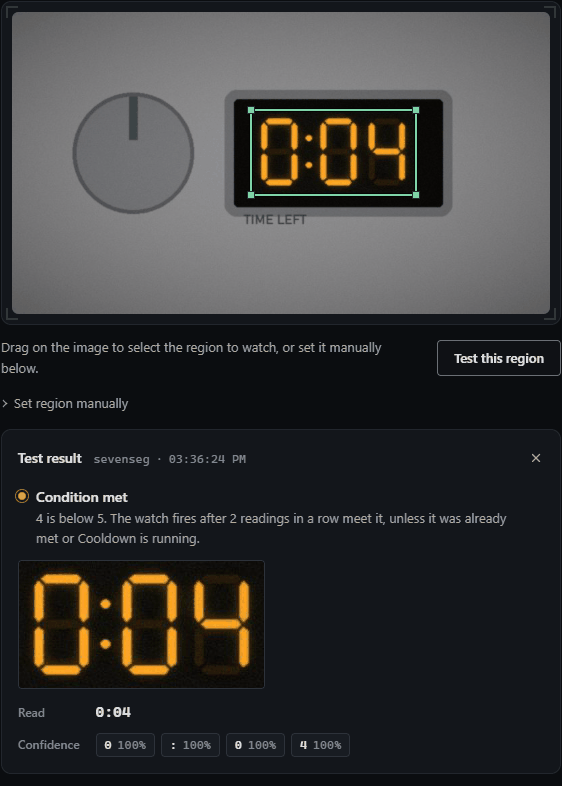

# Appliance time remaining

Washing machines, dryers, dishwashers and ovens count down on a seven-segment display: `1:23`, then `0:04`, then `End` or `0:00`. The built-in `sevenseg` decoder reads the countdown, colon included, so watchglass can tell you "5 minutes left" in time to be there when it finishes.

The sample frames are a washing machine with [1:23 left](samples/washer-1-23.jpg), with [0:04 left](samples/washer-0-04.jpg), and finished, showing [0:00](samples/washer-0-00.jpg) or [End](samples/washer-end.jpg).

## Five minutes left

```yaml
watches:
  - name: washer-almost-done
    source: http://192.168.1.80/snapshot.jpg
    interval: 30s
    region: {x: 0.44375, y: 0.3222, w: 0.30625, h: 0.2822}
    engine: sevenseg
    trigger:
      type: numeric
      # h:mm. Only 0:mm matches, so 1:23 (an hour and 23 minutes) is never
      # read as 23 minutes.
      pattern: "^0:([0-9]{2})$"
      op: lt
      threshold: 5
      confirm: 2
      cooldown: 1h
    notify:
      - ntfy://ntfy.sh/<TOPIC>

  - name: washer-finished
    source: http://192.168.1.80/snapshot.jpg
    interval: 30s
    region: {x: 0.44375, y: 0.3222, w: 0.30625, h: 0.2822}
    engine: sevenseg
    trigger:
      type: ocr_match
      # 0:00, or End: sevenseg can't read letters and reads End as "?".
      pattern: "^(0:00|\\?+)$"
      confirm: 2
      cooldown: 1h
    notify:
      - ntfy://ntfy.sh/<TOPIC>
```

<!-- sample-check: washer-almost-done samples/washer-1-23.jpg not-met reads=1:23 -->
<!-- sample-check: washer-almost-done samples/washer-0-04.jpg met reads=0:04 -->
<!-- sample-check: washer-finished samples/washer-1-23.jpg not-met reads=1:23 -->
<!-- sample-check: washer-finished samples/washer-0-04.jpg not-met reads=0:04 -->
<!-- sample-check: washer-finished samples/washer-0-00.jpg met reads=0:00 -->
<!-- sample-check: washer-finished samples/washer-end.jpg met reads=? -->

On the samples, the first watch reads `1:23` (the pattern doesn't match, so nothing happens) and then `0:04`, which is below 5. The second fires on `0:00`, and on `End`, which reads as `?`:



Notes:

- **Why the pattern.** Without one, a `numeric` watch takes the first number in the reading, which for `1:23` is the hours. `^0:([0-9]{2})$` only matches in the last hour and captures the minutes. A display that counts in minutes only (`83`, then `4`) needs `^([0-9]+)$` instead.
- **The end of the cycle.** Machines differ: some show `0:00`, some `End`, some go blank. `sevenseg` doesn't read letters: the sample's `End` comes back as a single `?`, which `^(0:00|\?+)$` catches. Press Test this region when yours has finished to see what it reads. A display that goes blank reads as nothing, and that is a normal poll: the Reading goes blank, nothing fires and no "down" alert is sent (that alert is for a camera that stops delivering frames). watchglass can't alert on a blank display today. If yours goes blank at the end, the smart plug below is the better "finished" signal, or an `ocr_changed` watch on the same box fires when the countdown stops reading, and on every minute change before that.
- **Timers that jump.** Some machines recalculate mid-cycle, so `0:04` can go back to `0:12`. The watch fires once when the time first drops below 5, and again only after it has gone above 5 and come back, and after the cooldown.
- **Door glass and glare.** Point the camera at the control panel, not through the door, and at a slight angle to keep ceiling lights off the display.

## With a smart plug

If the machine is already on a power-monitoring plug, the plug is the more reliable signal that it's running or done: power draw doesn't care about glare. A plug can't tell you how long is left, though, and the display can. They work well together in Home Assistant:

- **The plug** decides running or finished (see [WashData](https://github.com/3dg1luk43/ha_washdata), which learns your programs from the power curve).
- **watchglass** reports the time left. With an [`mqtt:` block](../home-assistant.md), each watch has a **Reading** sensor holding the display's text once it has held for `confirm` readings, `1:23` here. A template sensor turns that into minutes:

  ```yaml
  # Home Assistant configuration.yaml
  template:
    - sensor:
        - name: Washer minutes left
          unit_of_measurement: min
          state: >
            
            
              {{ t.split(':')[0] | int * 60 + t.split(':')[1] | int }}
            
  ```

  Check the entity ID on the watch's device in HA; it follows the watch's name.

A good split is to let the plug send "done" and watchglass send "5 minutes left", so you're walking over as it finishes.
