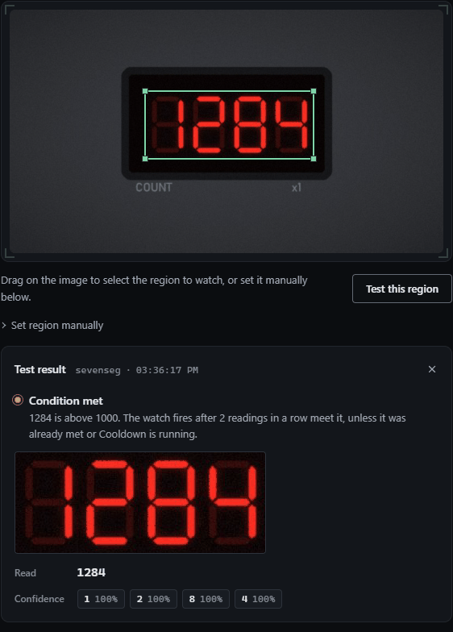

# Moving over from seven_segments / ssocr

Home Assistant's [seven_segments](https://www.home-assistant.io/integrations/seven_segments/) integration reads a digit display by running [ssocr](https://www.unix-ag.uni-kl.de/~auerswal/ssocr/) on a crop of a camera image. Getting it to work means guessing pixel coordinates, a threshold and ssocr arguments, restarting HA, and reading the result off an entity. watchglass reads the same displays with its built-in `sevenseg` decoder, and you draw the crop on the live picture and see what it reads before saving. No ssocr to install.

## The same display, both ways

The sample frame for this recipe is [samples/seven-segment-counter.jpg](samples/seven-segment-counter.jpg): an 800x450 camera view of a four-digit red LED counter showing `1284`.

A typical seven_segments setup for it:

```yaml
# Home Assistant configuration.yaml (the old way)
image_processing:
  - platform: seven_segments
    x_position: 250
    y_position: 150
    width: 310
    height: 125
    digits: 4
    threshold: 20
    extra_arguments: -f white
    source:
      - entity_id: camera.counter
```

The same thing in watchglass:

```yaml
watches:
  - name: counter
    # The camera's own snapshot URL is best (see camera-urls.md). A camera
    # that is only in Home Assistant can be read through HA's camera proxy.
    source: http://homeassistant.local:8123/api/camera_proxy/camera.counter
    headers:
      - "Authorization: Bearer <LONG_LIVED_TOKEN>"
    interval: 10s
    region: {x: 0.3125, y: 0.3333, w: 0.3875, h: 0.2778}
    engine: sevenseg
    trigger:
      type: numeric
      op: gt
      threshold: 1000
      confirm: 2
    notify:
      - ntfy://ntfy.sh/<TOPIC>
```

<!-- sample-check: counter samples/seven-segment-counter.jpg met reads=1284 -->

Tested against the sample, it reads `1284`, every digit at full confidence:



In practice you don't type the region: open the watch, drag a box around the digits, pick **Digit display** and press **Test this region**.

## Setting by setting

| seven_segments | watchglass |
|---|---|
| `x_position`, `y_position`, `width`, `height` (pixels) | `region`, as fractions of the frame: `x = x_position / frame width`, `y = y_position / frame height`, `w = width / frame width`, `h = height / frame height`. For the 800x450 sample: 250/800 = 0.3125, 150/450 = 0.3333, 310/800 = 0.3875, 125/450 = 0.2778. Or just draw the box. |
| `threshold` | Leave it out. `sevenseg` picks its own threshold for each crop. If a very washed-out display needs one, `preprocess: {threshold: N}` takes a grey level from 1 to 255, where ssocr took a percentage (50% is about 128). |
| `-f white`, `invert` | Not needed. `sevenseg` works out whether the digits are light on dark (LEDs) or dark on light (LCDs). |
| `digits` | Not needed. It reads however many digits are lit. Blank leading positions are skipped, so ` 23.5` reads `23.5`. |
| `extra_arguments` such as `-D`, `dilation`, `erosion`, `make_mono`, `greyscale` | Not needed. The decoder copes with the gaps between bars, LED glow and the faint unlit "ghost" segments. Test this region shows the crop it used, which replaces ssocr's debug image. |
| `rotate` | watchglass doesn't rotate frames itself. Mount the camera level, or let ffmpeg turn the picture: `source: "ffmpeg:-i http://<CAMERA>/snapshot.jpg -vf rotate=-4*PI/180"` straightens a display that leans 4° clockwise. A mild slant in the digits' own font is fine as it is. |
| `source: entity_id` | The camera's snapshot URL, or HA's camera proxy as above. |
| The `image_processing` entity's state | The watch's **Value** sensor over MQTT, with a unit and device class if you give it one. See [home-assistant.md](../home-assistant.md). |

## What you get that ssocr didn't give you

- **You see the read before you trust it.** Test this region shows one chip per digit with a confidence, so a marginal digit is obvious.
- **Misreads don't reach HA.** The Value is the median of the last few readings, and with `confirm: 2` a single misread digit never reaches the history graph.
- **Letters come back as `?`,** not as a wrong digit. `E4` on a boiler reads `?4`, which a pattern can catch (see the [heat pump recipe](heat-pump-boiler-panel.md)).
- **Alerts without an automation.** The watch fires on its own threshold and sends to ntfy, Telegram or any other service.
- **A dead camera is noticed.** Three failed polls in a row (no frame, or the engine errored) send one "down" alert. A display that reads as blank is a normal poll and doesn't count.

## Limits

`sevenseg` reads 0-9, a leading minus, the decimal point and a colon (`1:23`). It doesn't read letters, it expects upright digits, and it doesn't read fourteen-segment or dot-matrix displays; use `engine: tesseract` or `rapidocr` for those. [The lab instrument recipe](lab-instrument-seven-segment.md) covers cropping and what still trips it up.
