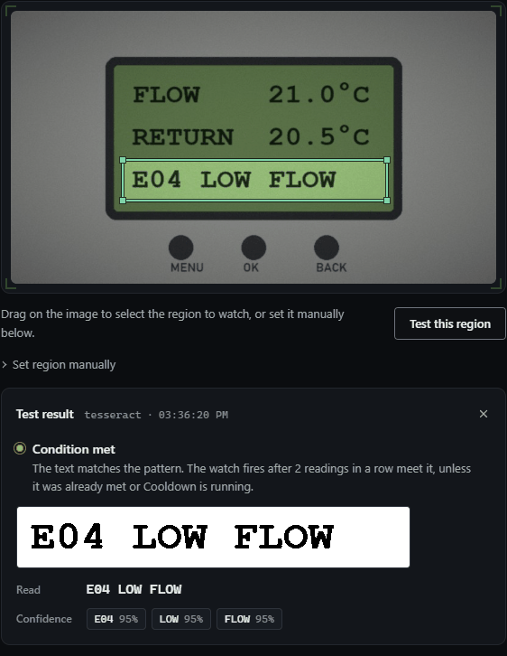
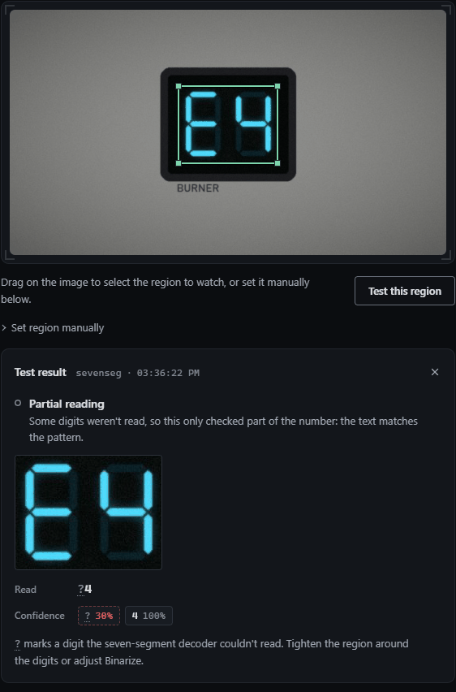

# Heat pump or boiler panel

Heat pumps, boilers, water heaters and HVAC units often have no API, or one locked behind a cloud account, but their panel shows exactly what you want: the flow temperature, and a fault code when something goes wrong. A camera on the panel turns both into something you can act on:

- the temperature as a Home Assistant sensor you can graph, with an alert when it drops, and
- a push to your phone, with the picture of the panel attached, when a fault code like `E04` appears.

Two kinds of panel are covered: a text LCD, read with tesseract, and a seven-segment display, read with the built-in decoder.

## A text LCD

The sample frames are a heat pump controller running normally ([heat-pump-panel.jpg](samples/heat-pump-panel.jpg), FLOW 52.5°C) and the same panel after a flow fault ([heat-pump-fault.jpg](samples/heat-pump-fault.jpg), FLOW 21.0°C and `E04 LOW FLOW`).

```yaml
watches:
  # The flow temperature, as an HA sensor, with an alert when it drops
  # below 30 °C (the heat pump has stopped heating).
  - name: heat-pump-flow
    source: http://192.168.1.70/snapshot.jpg
    interval: 30s
    region: {x: 0.23125, y: 0.2333, w: 0.54375, h: 0.1489}
    preprocess:
      grayscale: true
      threshold: 110
    trigger:
      type: numeric
      pattern: "FLOW\\s*(-?[0-9]+\\.?[0-9]*)"
      op: lt
      threshold: 30
      confirm: 3
      cooldown: 1h
    unit: "°C"
    device_class: temperature
    notify:
      - ntfy://ntfy.sh/<TOPIC>

  # Fault codes: E or F followed by one to three digits, on the status line.
  - name: heat-pump-fault
    source: http://192.168.1.70/snapshot.jpg
    interval: 30s
    region: {x: 0.23125, y: 0.5444, w: 0.54375, h: 0.1489}
    preprocess:
      grayscale: true
      threshold: 110
    trigger:
      type: ocr_match
      pattern: "(?i)\\b[EF]\\d{1,3}\\b"
      confirm: 2
      cooldown: 1h
    notify:
      - ntfy://ntfy.sh/<TOPIC>
```

<!-- sample-check: heat-pump-flow samples/heat-pump-panel.jpg not-met -->
<!-- sample-check: heat-pump-flow samples/heat-pump-fault.jpg met -->
<!-- sample-check: heat-pump-fault samples/heat-pump-panel.jpg not-met -->
<!-- sample-check: heat-pump-fault samples/heat-pump-fault.jpg met -->

Tested on the fault frame, the flow watch reads 21.0 (below 30) and the fault watch `E04 LOW FLOW`; on the normal frame they read 52.5 and `MODE HEAT` (no code):



Why it's set up this way:

- **One watch per line.** tesseract reads the region as a single line of text, so the temperature and the status line get a box each. Two watches on one camera cost two snapshot requests per poll, nothing more.
- **`grayscale` and `threshold: 110`.** Without them, tesseract read this panel's `52.5°C` as `525-6`: the decimal point and the degree sign got lost in the green backlight. Turning the crop black and white fixed it. Tune the number with Test this region on your own panel; the crop preview shows what tesseract gets.
- **The pattern's capture group** picks the number after `FLOW`, whatever the rest of the line reads. The degree sign can come back as `°`, `o` or nothing, and the pattern doesn't care.
- **`confirm: 3` and a 30 s interval.** A temperature that's still falling isn't an emergency, so the alert waits for three readings in a row below 30. The Value sensor in HA is the median of the last five readings, so a misread never makes a spike in the graph.
- **`\b[EF]\d{1,3}\b`** matches `E04`, `F28` or `e1` as a word on its own, and not the E in `HEAT` or `FLOW`. If your manual lists codes in another shape (`ER 04`, `A-12`), change the pattern and test it. OCR sometimes reads a `0` as `O` or `@`; if Test this region shows that, widen the digits: `[EF][0-9O@]{1,3}`.

## A seven-segment display

Many boilers show the water temperature on a two-digit LED display and the fault code on the same digits. The built-in `sevenseg` decoder reads the digits, and reads a letter it can't decode as `?`, so `E4` comes back as `?4`. Samples: [boiler-seven-segment-temp.jpg](samples/boiler-seven-segment-temp.jpg) (52) and [boiler-seven-segment-fault.jpg](samples/boiler-seven-segment-fault.jpg) (E4).

```yaml
watches:
  - name: boiler-temp
    source: http://192.168.1.71/snapshot.jpg
    interval: 30s
    region: {x: 0.3875, y: 0.3111, w: 0.225, h: 0.3111}
    engine: sevenseg
    trigger:
      type: numeric
      # Only a clean temperature: "?4" (fault E4) must not count as 4 °C.
      pattern: "^([0-9]{1,3})$"
      op: lt
      threshold: 40
      confirm: 3
      cooldown: 1h
    unit: "°C"
    device_class: temperature
    notify:
      - ntfy://ntfy.sh/<TOPIC>

  - name: boiler-fault
    source: http://192.168.1.71/snapshot.jpg
    interval: 30s
    region: {x: 0.3875, y: 0.3111, w: 0.225, h: 0.3111}
    engine: sevenseg
    trigger:
      type: ocr_match
      # A letter, then digits: the shape of E4, F28, A1 on this kind of display.
      pattern: "^\\?[0-9]+$"
      confirm: 3
      cooldown: 1h
    notify:
      - ntfy://ntfy.sh/<TOPIC>
```

<!-- sample-check: boiler-temp samples/boiler-seven-segment-temp.jpg not-met reads=52 -->
<!-- sample-check: boiler-temp samples/boiler-seven-segment-fault.jpg not-met reads=?4 -->
<!-- sample-check: boiler-fault samples/boiler-seven-segment-temp.jpg not-met reads=52 -->
<!-- sample-check: boiler-fault samples/boiler-seven-segment-fault.jpg met reads=?4 -->

On the sample frames, `boiler-temp` reads `52` and `boiler-fault` matches `?4`. Test this region calls a reading with a `?` in it a "Partial reading", since it usually means a digit was missed; here the `?` is what the watch looks for, and the line under the verdict says the text matches the pattern:



A `?` also shows up when a digit is caught half-lit or behind a reflection, which is why the fault watch wants three readings in a row. The alert tells you a code is showing; the photo attached to the ntfy push tells you which.

## Mounting the camera

- **Glare** is the main enemy. A glossy panel reflects windows and ceiling lights, and a reflection across a digit reads as a different digit. Angle the camera 10-20° off square, so reflections go past it, and check the view with the room lights on and off, and in daylight.
- **Angle**: keep it as close to head-on as the glare allows. tesseract copes with a little perspective; `sevenseg` expects upright digits and loses side bars on a strong slant.
- **Backlight timeout**: many panels turn the backlight off after a minute. A dark LCD reads as nothing: the poll counts as a normal one, the Reading in Home Assistant goes blank, the Value sensor keeps its last number, and no alert goes out. watchglass doesn't alert on a blank display today; "down" is only for a camera that stops delivering frames. If your panel always goes dark, look for a setting that keeps it on, or watch the one indicator that stays lit (a fault LED) with `pixel_change`. To be told when the backlight goes off, an `ocr_changed` watch on the same box fires when the reading changes, blank included, but also on every other change.
- **Night**: a camera with IR night vision may wash out an LCD. Most panels are lit anyway; turn the camera's IR off if it helps.

## In Home Assistant

With an [`mqtt:` block](../home-assistant.md), `heat-pump-flow` and `boiler-temp` each get a **Value** sensor in °C with the temperature device class, so HA graphs them and keeps long-term statistics. The fault watches' **Motion** entity turns on when a code appears, which an automation can use to switch the heat pump's supply off, for example.
