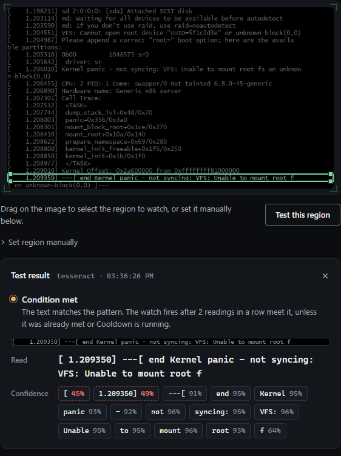

# Server console, IPMI and KVMs (PiKVM, NanoKVM, JetKVM)

**If your server's BMC speaks Redfish or IPMI over LAN, query that for sensor values**: `ipmitool`, `freeipmi` or a Redfish client give you exact numbers. What a BMC can't tell you is what's on the screen, and that's where a server that didn't come back after a reboot tells you why: a kernel panic, GRUB's rescue prompt, "No bootable device". This recipe watches the console for those, through a KVM-over-IP box or a capture card, and sends you the screen.

## Getting the console picture

| KVM | Source | Notes | Status |
|---|---|---|---|
| PiKVM | `https://<PIKVM>/api/streamer/snapshot` with `tls_insecure: true` and `headers: ["X-KVMD-User: <USER>", "X-KVMD-Passwd: <PASSWORD>"]` | PiKVM serves HTTPS with a self-signed certificate, hence `tls_insecure`. With two-factor login on, append the current code to the password, which makes it useless for a watch; use a separate user without 2FA. | from [vendor docs](https://docs.pikvm.org/api/) |
| NanoKVM | `http://<NANOKVM>/api/stream/mjpeg` with `headers: ["Cookie: nano-kvm-token=<TOKEN>"]` | The stream needs the login cookie. Log in to the NanoKVM in a browser and copy the `nano-kvm-token` cookie from the browser's developer tools. It lasts 31 days by default; when it runs out, the watch gets "turned down the login" and sends a "down" alert. On a network you trust, `authentication: disable` in the NanoKVM's `/etc/kvm/server.yaml` removes the login instead. | from [source](https://github.com/sipeed/NanoKVM/blob/main/server/middleware/jwt.go) |
| JetKVM | none | JetKVM sends its video over WebRTC only, with no snapshot or MJPEG URL. Split the server's HDMI to a USB capture card instead (below). | from [source](https://github.com/jetkvm/kvm) |
| A USB HDMI capture card | `v4l2:/dev/video0` (Linux), `dshow:video=<CARD NAME>` (Windows) | Works with any server and no KVM at all. Needs ffmpeg; `ffmpeg -list_devices true -f dshow -i dummy` lists the Windows names. | |
| A KVM or BMC that offers RTSP | its `rtsp://` URL | Needs ffmpeg. | |

## Watches for boot trouble

The sample frames are a console after a kernel panic ([console-kernel-panic.png](samples/console-kernel-panic.png)) and GRUB's rescue prompt ([console-grub-rescue.png](samples/console-grub-rescue.png)), both 720x400, which is how a KVM captures a text console.

### With rapidocr: the whole screen, one watch

tesseract reads one line of text per watch. rapidocr reads a whole screen, so one watch covers every message wherever it lands. It needs Python with `pip install rapidocr onnxruntime`, which the Docker image doesn't have; without it, use the tesseract watches further down.

```yaml
watches:
  - name: console-boot-trouble
    source: https://pikvm.lan/api/streamer/snapshot
    tls_insecure: true
    headers:
      - "X-KVMD-User: <USER>"
      - "X-KVMD-Passwd: <PASSWORD>"
    interval: 60s
    health_after: 3
    region: {x: 0, y: 0, w: 1, h: 1}
    engine: rapidocr
    trigger:
      type: ocr_match
      pattern: "(?i)kernel panic|grub rescue|no bootable device"
      confirm: 2
      cooldown: 1h
    notify:
      - ntfy://ntfy.sh/<TOPIC>
```

<!-- sample-check: console-boot-trouble samples/console-kernel-panic.png met -->
<!-- sample-check: console-boot-trouble samples/console-grub-rescue.png met -->

### With tesseract: one watch per line

A panic fills the screen and ends with `---[ end Kernel panic - not syncing: … ]---`, which lands on the last or second-to-last row depending on how it wraps. GRUB's rescue prompt sits near the top of a cleared screen. One watch per row covers them. On a 25-row text console each row is 0.04 of the height.

```yaml
watches:
  - name: console-panic-row-24
    source: https://pikvm.lan/api/streamer/snapshot
    tls_insecure: true
    headers:
      - "X-KVMD-User: <USER>"
      - "X-KVMD-Passwd: <PASSWORD>"
    interval: 60s
    region: {x: 0, y: 0.92, w: 1, h: 0.04}
    trigger:
      type: ocr_match
      pattern: "(?i)kernel panic"
      confirm: 2
      cooldown: 1h
    notify:
      - ntfy://ntfy.sh/<TOPIC>

  - name: console-panic-row-25
    source: https://pikvm.lan/api/streamer/snapshot
    tls_insecure: true
    headers:
      - "X-KVMD-User: <USER>"
      - "X-KVMD-Passwd: <PASSWORD>"
    interval: 60s
    region: {x: 0, y: 0.96, w: 1, h: 0.04}
    trigger:
      type: ocr_match
      pattern: "(?i)kernel panic"
      confirm: 2
      cooldown: 1h
    notify:
      - ntfy://ntfy.sh/<TOPIC>

  - name: console-grub-rescue
    source: https://pikvm.lan/api/streamer/snapshot
    tls_insecure: true
    headers:
      - "X-KVMD-User: <USER>"
      - "X-KVMD-Passwd: <PASSWORD>"
    interval: 60s
    region: {x: 0, y: 0.08, w: 1, h: 0.04}
    trigger:
      type: ocr_match
      pattern: "(?i)grub rescue|no bootable device"
      confirm: 2
      cooldown: 1h
    notify:
      - ntfy://ntfy.sh/<TOPIC>
```

<!-- sample-check: console-panic-row-24 samples/console-kernel-panic.png met -->
<!-- sample-check: console-panic-row-25 samples/console-kernel-panic.png not-met -->
<!-- sample-check: console-grub-rescue samples/console-grub-rescue.png met -->
<!-- sample-check: console-grub-rescue samples/console-kernel-panic.png not-met -->

On the panic frame, row 24 reads `[ 1.209350] ---[ end Kernel panic - not syncing: VFS: Unable to mount root f`:



Drawing a one-row box by hand is fiddly; the region fields under the stage take exact numbers (x 0, y 0.92, w 1, h 0.04 for row 24). If your KVM scales the console to another size, the fractions stay the same as long as it's 25 rows.

### The "down" alert

If the KVM itself stops answering (it lost power, or the network did), the watch gets no frame, and after `health_after` polls it sends one "down" alert, then one when the KVM is back. With a 60 s interval and `health_after: 3`, that's about three minutes. Only one of the watches above needs to say so; give the others a larger `health_after` if you'd rather get the alert once.

## A temperature on the console

The other use: a machine whose sensor readout is only on its screen, or an old BMC's console page. A `numeric` trigger with a capture group reads the number:

```yaml
watches:
  - name: db-server-cpu-temp
    # An IP-KVM's RTSP feed, or a USB capture card on the console cable
    # (v4l2:/dev/video0 on Linux, dshow:video=... on Windows).
    source: rtsp://192.168.1.70:554/kvm
    interval: 20s
    max_interval: 5m
    health_after: 6     # KVM and capture links blip more than a wired camera
    region: {x: 0.05, y: 0.90, w: 0.35, h: 0.08}
    preprocess:
      grayscale: true
      threshold: 160
    trigger:
      type: numeric
      pattern: "CPU Temp:\\s*([0-9]+)C"
      op: gt
      threshold: 85
      confirm: 2
      cooldown: 15m
    notify:
      - ntfy://ntfy.sh/<TOPIC>
```

- The capture group `([0-9]+)` makes watchglass read the number after `CPU Temp:` and not a slot number or a fan speed elsewhere in the box. Without a group, the first number in the text is used.
- `health_after: 6` instead of 3: KVM sessions and capture cards drop the odd frame, and a false "down" alert is worse than a slower one.
- `max_interval: 5m` backs off while the value holds, because server temperatures don't swing fast.
- `confirm: 2` counts readings **above the threshold**, not identical readings, so a temperature that moves a degree every poll still fires once it has been above 85 twice in a row.
- It fires once on crossing 85, and again only after it has gone back below and crossed again (and the cooldown has passed).

## Caveats

- KVM video is often lower resolution and more compressed than a camera. Small text that reads fine on a camera can be unreadable through a lossy KVM link. A higher video quality setting on the KVM helps more than any `preprocess` tuning.
- A graphical boot splash hides the text console. For a server you want to watch, boot with the splash off (`quiet splash` removed from the kernel command line).
- Nothing here checks that the number is the right one: get the region and pattern tight, and check the reading strip after a firmware update or a change of console resolution.
